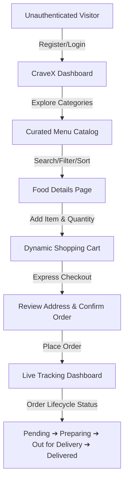

---

# 🍔 CraveX — Premium Food Delivery Web Application

[](https://www.djangoproject.com/)
[](https://www.python.org/)
[](https://getbootstrap.com/)
[](https://opensource.org/licenses/MIT)

**CraveX** is a minimalist, luxury-themed food ordering platform inspired by high-end, premium quick-service dining. Unlike generic platforms cluttered with hundreds of average choices, CraveX focuses on a curated, exclusive selection of gourmet chicken buckets, artisanal pizzas, handcrafted burgers, premium mocktails, and decadent desserts.

Built with **Django (MVT Architecture)** and a modern **Dark-Luxury UI Design System**, CraveX delivers a premium, fast, and highly interactive user experience..

---

## 📸 User Interface Preview
*(To showcase your application, insert screenshots of your pages below)*

| 🏠 Home Dashboard | 🍕 Food Menu |
| --- | --- |
|  |  |

| ⭐ Premium Featured Collection | 🍔 Food/Product Details |
| --- | --- |
|  |  |

| 🛒 Shopping Cart | 💳 Checkout Page |
| --- | --- |
|  |  |

| 📍 Live Order Tracking | 📝 Registration Page |
| --- | --- |
|  |  |
---

## 🗺️ System Architecture & User Journey

The diagram below illustrates the customer lifecycle and application flow from login to real-time delivery status:



---

## ✨ Core Features

### 🔒 1. Authentication & Custom User Profiles
* **Secure Auth:** Fully integrated Django registration, login, and session-based logout flows.
* **Smart User Profiles:** Automatic profile generation (`UserProfile`) on registration to store phone numbers and delivery addresses, minimizing steps during future checkouts.

### 🍽️ 2. High-Impact Curated Menu & Food Catalog
* **Premium Theme Aesthetics:** Rich dark UI featuring high-impact crimson red accents and elegant gold elements designed for Indian fine-dining context.
* **Advanced Catalog Tools:** Real-time search query matching, categories filtering (Chicken Specials, Pizza, Burgers, Sides, Drinks, Desserts), and sorting (by rating or price low-to-high/high-to-low).
* **Detailed Food Cards:** Complete view of premium ingredients, ratings, availability badges, and interactive quantity controllers.

### 🛒 3. Dynamic Cart & Shopping Ledger
* **Immediate Adjustments:** Real-time item additions and quantity management.
* **Auto-calculations:** Live subtotal, delivery charges, and final grand totals automatically calculated in the template.
* **Persisted Sessions:** Cart states are linked dynamically to user instances and remain active across sessions.

### 💳 4. Express One-Click Checkout
* **Pre-Filled Shipping Details:** Checkout inputs are auto-populated from the user's `UserProfile` for a seamless ordering process.
* **Consolidated Invoice:** Detailed list of all ordered items, individual item subtotals, and total billing before checking out.

### 📍 5. Live Order Tracking & Lifecycle Progression
* **Visual Status Tracker:** Interactive status indicator bar that updates dynamically (`Pending` ➔ `Preparing` ➔ `Out for Delivery` ➔ `Delivered`).
* **Order History Archive:** Customers can access past invoices, address files, phone logs, and order receipts in one central screen.

### ⚙️ 6. Admin Control Center
* **Superuser Panel:** Full database management at `/admin/` for Category creation, custom FoodItem creation (with ratings, image uploads, featured toggles), and real-time order status tracking updates.

---

## 🛠️ Technology Stack

| Component | Technology | Description |
|---|---|---|
| **Backend Framework** | Django 4.2 | Robust, scalable Python MVC framework (MVT structure). |
| **Language** | Python 3.9+ | Clean, object-oriented backend programming. |
| **Database** | SQLite3 | Local Relational database used for development storage. |
| **UI Styling** | Custom CSS3 + Bootstrap 5 | Bespoke luxury dark theme styling, flex grids, and utility classes. |
| **Icons & Fonts** | FontAwesome 6 & Google Fonts |Outfit & Inter typography styles paired with vector icons. |
| **Image Processing**| Pillow | Server-side image manipulation and processing library. |
| **Data Generation** | PIL Draw Scripts | Custom canvas image seed scripts to generate luxury dish banners. |

---

## 📂 Project Directory Structure

```text
Food Deliver App/
│
├── cravex/               # Django Project Core Configuration
│   ├── __init__.py
│   ├── settings.py       # Global Settings (Installed Apps, Static, Media)
│   ├── urls.py           # Global Routing Patterns
│   └── wsgi.py / asgi.py
│
├── accounts/             # Authentication & User Profile Manager
│   ├── models.py         # UserProfile (Phone, Address, Sign-up signals)
│   ├── forms.py          # UserProfile update & registration forms
│   └── views.py          # Register, Login, Profile controllers
│
├── menu/                 # Product Catalog & Category Engine
│   ├── models.py         # Category and FoodItem Schema (Price, Rating, Ingredients)
│   ├── urls.py           # Menu path mappings
│   └── views.py          # Menu list, detailed food display & sorting
│
├── cart/                 # Cart Lifecycle Manager
│   ├── models.py         # Cart & CartItem records
│   ├── context_processors.py # Injects live cart counts into Navbar globally
│   └── views.py          # AJAX add/remove/update logic
│
├── orders/               # Orders & Live Tracking Dispatcher
│   ├── models.py         # Order, OrderItem & Tracking statuses
│   └── views.py          # Checkout, order creation, and live tracking UI
│
├── static/               # Central Static Assets
│   ├── css/
│   │   └── style.css     # Premium luxury Dark-Theme Design Tokens
│   └── js/
│       └── main.js       # UI interactions, alerts, dynamic count adjustments
│
├── templates/            # Django HTML Document Templates
│   ├── base.html         # Base Layout (Header, Footer, Dark Navigation)
│   ├── accounts/         # Login, Register, Profile templates
│   ├── menu/             # Home page, Menu list, Food details
│   ├── cart/             # Cart Summary layout
│   └── orders/           # Checkout form, order receipts, status tracker
│
├── media/                # User uploaded & seeded food images
│   └── food_images/      
│
├── seed_data.py          # Automated Database Seeding Script (Users, Items, Custom Canvas Graphics)
├── manage.py             # Django Manager CLI Utility
└── db.sqlite3            # SQLite database file
```

---

## ⚡ Quick Setup & Local Installation

### 1. Prerequisites
Make sure you have **Python 3.9+** and `pip` installed on your machine.

### 2. Clone the Repository & Open Workspace
```bash
git clone https://github.com/SoubhagYA-Kabiraj/Food_Delivery_App.git
cd Food_Delivery_App
```

### 3. Install Required Packages
Install Django and Pillow (required for database images handling):
```bash
pip install django pillow
```

### 4. Apply Database Migrations
Set up your database tables and models:
```bash
python manage.py makemigrations
python manage.py migrate
```

### 5. Seed Database & Generate Luxury Image Assets
CraveX includes an automated database seeder (`seed_data.py`). Running this script:
1. Registers the administrator credentials.
2. Registers a demo customer account.
3. Automatically sets up food categories.
4. Generates custom food graphics and uploads them to the media folder.
5. Populates 13 premium food items with ingredients, ratings, prices, and settings.

```bash
python seed_data.py
```

### 6. Run the Development Server
```bash
python manage.py runserver 8080
```
Open your browser and navigate to: 👉 **[http://127.0.0.1:8080/](http://127.0.0.1:8080/)**

---

## 🔑 Pre-Configured Test Credentials

For quick evaluation, use the credentials seeded from `seed_data.py`:

### 👑 System Administrator (Admin Dashboard)
* **Access URL:** `http://127.0.0.1:8080/admin/`
* **Username:** `admin`
* **Password:** `admin123`
* *(Provides full access to manage categories, modify prices, update orders status, and view active user profiles).*

### 👤 Demo Customer Account (Front-End Checkout)
* **Access URL:** `http://127.0.0.1:8080/accounts/login/`
* **Username:** `crave_lover`
* **Password:** `password123`
* *(Preloaded with a delivery address and phone number for testing checkout and live order progression tracking).*

---

## 📝 License

Distributed under the MIT License. See `LICENSE` for more details.

---
*Created with ❤️ by [Soubhagya Kabiraj](https://github.com/SoubhagYA-Kabiraj)*
